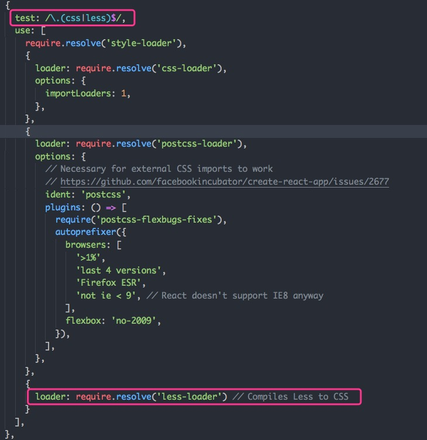
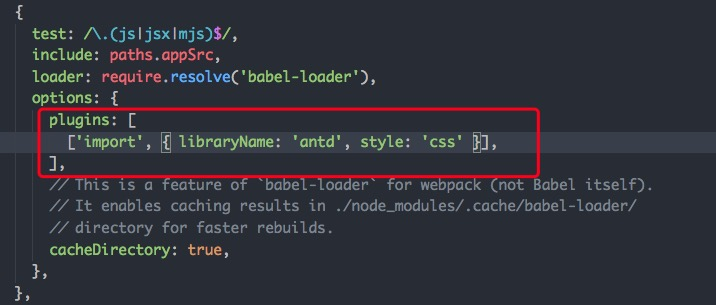

# react项目初始化

使用 react react-router less 构建 react 项目

## 在 create-react-app 中使用 less

1. yarn add less less-loader --dev or npm install less less-loader --save-dev

2. yarn run eject or npm run eject

3. 修改 webpack.config.dev.js 和 webpack.config.prod.js

## 在 create-react-app 中使用 antd

1. yarn add babel-plugin-import --dev or npm install babel-plugin-import --save-dev

2. 修改 webpack.config.dev.js 和 webpack.config.prod.js

